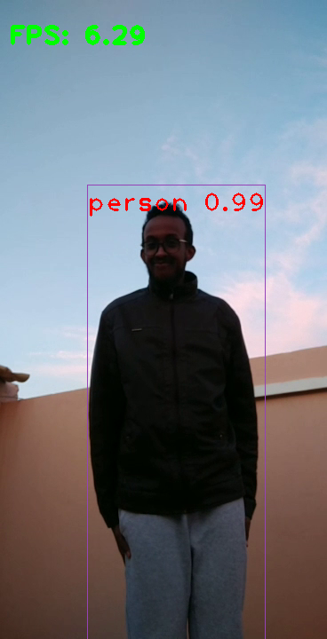
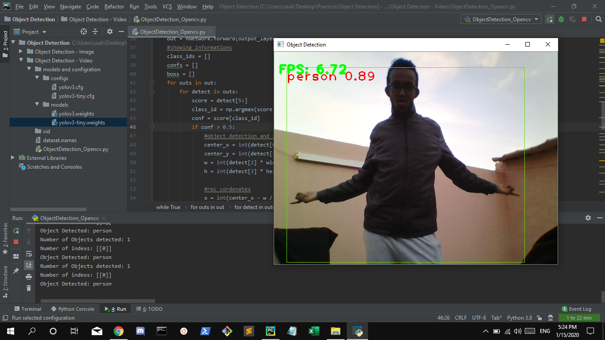

# RTD
Real-Time recognition using openCV and deep neural network (DNN) with OpenCV

```diff
- Python version: 3.8.0
- Python Libraries: (NumPy): pip install numpy, (openCV): pip install opencv-python
```



